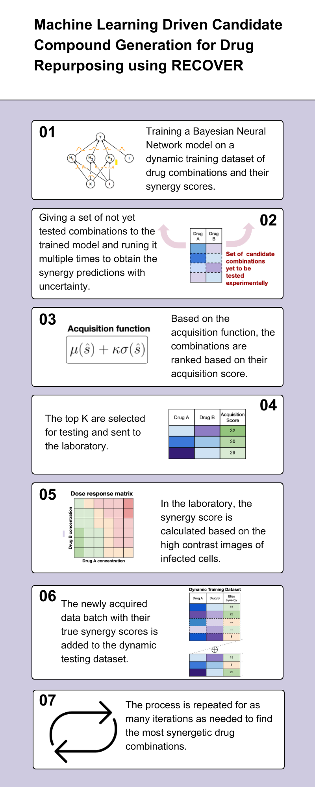

# Machine Learning Driven Candidate Compound Generation for Drug Repurposing
Based on RECOVER: sequential model optimization platform for combination drug repurposing identifies novel synergistic compounds *in vitro*

This repository is an implementation of RECOVER, a platform that can guide wet lab experiments to quickly discover synergistic drug combinations,
([preprint](https://arxiv.org/abs/2202.04202)), howerver instead of using an ensemble model to get Synergy predictions with uncertainty, we used multiple realization of a Bayesian Neural Network model. 
Since the weights are drawn from a distribution, they differ for every run of a trained model and hence give different results. The goal was to get a more precise uncertainty and achieve i quicker since the model doesn't have to be trained multiple times. 

  

## Weighted Uncertainty in Bayesian Neural Networks
Incorporating weighted uncertainty into Bayesian Neural Networks (BNNs) enhances their predictive capabilities, allowing for a more nuanced understanding of model confidence. Inspired by the research outlined in the article, the implementation focused on introducing weighted uncertainty through a Bayesian framework. Implemetation is inspired by [bayes-by-backprop](https://github.com/nitarshan/bayes-by-backprop/tree/master)

### Implementation Details
1. **Layers Module:**  
   Implemented a versatile layers module within the `models/predictors.py` file, providing flexibility by incorporating both weighted uncertainty with and without dropout. Dropout method is inspired by [variational-dropout-sparsifies-dnn](https://github.com/bayesgroup/variational-dropout-sparsifies-dnn)

2. **Bayesian Neural Network:**  
   Extended the predictive capabilities by incorporating a Bayesian Neural Network into the `models/predictors.py` file. This empowers the model to leverage uncertainty information for more informed predictions.

3. **KL Loss Method:**  
   Implemented the Kullback-Leibler (KL) loss method, as suggested by the article, within the `models/predictors.py` file. This addition is crucial for training the Bayesian model effectively, ensuring convergence to a meaningful weight distribution.

4. **Configuration Files:**  
   Introduced configuration files tailored for the Bayesian basic trainer and active trainer in the `config` directory. These files capture the necessary settings for training Bayesian models, providing a clear and organized structure for experimentation.

5. **Codebase Modifications:**  
   Ensured seamless integration by making necessary adjustments in the `train.py` and `models/model.py` files. These modifications align the training process with the new Bayesian approach, allowing for the proper utilization of weighted uncertainty.

The implemented changes collectively enhance the expressiveness and reliability of the Bayesian Neural Network, paving the way for improved model interpretability and performance. By enabling weighted uncertainty, the model gains the ability to assign varying degrees of importance to different data points during training, ultimately leading to more robust and accurate predictions.
## Environment setup

**Requirements and Installation**: 
For all the requirements and installation steps check th orginal RECOVER repository (https://github.com/RECOVERcoalition/Recover.git). 

## Running the pipeline

Configuration files for our experiments are provided in the following directory: `Recover/recover/config`

To run the pipeline with a custom configuration:
- Create your configuration file and move it to `Recover/recover/config/`
- Run `python train.py --config <my_configuration_file>`

For example, to run the pipeline with configuration from 
the file `model_evaluation.py`, run `python train.py --config model_evaluation`.

Log files will automatically be created to save the results of the experiments.
