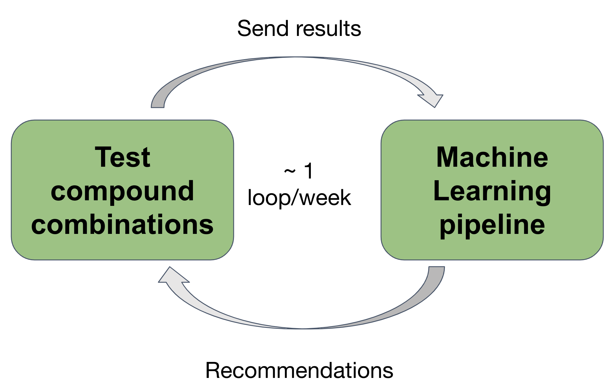
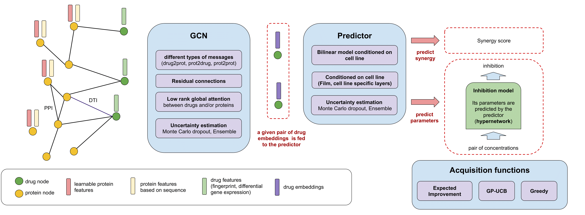
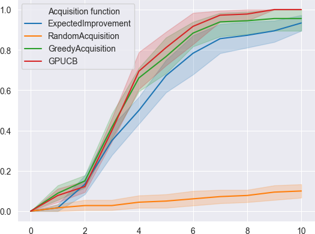

# Recover: Exploring the space of drug combinations to discover synergistic drugs using Active Learning

RECOVER coalition (Mila, Relation Therapeutics)

This Recover repository is based on research funded by (or in part by) the Bill & Melinda Gates Foundation. The findings and 
conclusions contained within are those of the authors and do not necessarily reflect positions or policies of the Bill & Melinda Gates Foundation.

## Abstract

**How to quickly find good drug combination treatments?**

Drug repurposing allows for a fast response to pandemics, and exploring combinations of drugs opens new possibilities 
for tailoring therapies to a given disease and targeting several biological pathways at the same time. This comes at the 
cost of additional challenges: the number of all possible drug combinations is huge, and only a tiny portion of this 
space can be explored in a reasonable amount of time. 

One could either narrowly focus on experimenting with a very restricted number of well-chosen drugs, based on pre-existing 
biological knowledge, or broaden the scope by exploring uncharted territories with the risk of very low time and cost 
efficiency. 

In order to balance between those two approaches, **we propose to drive the exploration of the drug combination space with 
an active learning based algorithm**. At regular intervals, the algorithm recommends a list of drug combinations to be 
tested in vitro, and the results of the experiments are added to the training data to update the model. 

Our proposed algorithm integrates several data modalities (protein-protein interaction network, drug 
targets, drug structure, transcriptomic signatures), makes use of recent deep learning approaches such 
as graph convolutional networks and attention, Monte Carlo dropout for uncertainty estimation, and several acquisition 
functions for efficient exploration.

## Description of the components of the pipeline

There are three main components in the pipeline:
- Aggregation of several data modalities together in a **knowledge graph**
- **Graph Convolutional Network** model which makes predictions about pairs of drugs
- **Acquisition functions** to decide which combinations of drugs will be queried next

There are two different tasks. Given a combination of drugs and a cell line, we can:
- **predict synergy scores** directly
- **predict the inhibition landscape** with an inhibition model (itself predicted by a hypernetwork)

The models include **uncertainty estimation** via Ensembling and Monte Carlo dropout. The estimation of uncertainty is 
used by the **acquisition functions**.

## Early results

Our early simulations on historical oncology data suggest that, compared to a naive approach,
a 10 fold improvement in the speed at which best combinations are found is possible.

- **y-axis**: Proportion of top 1% synergistic combinations which have been discovered along active learning training.
- **x-axis**: Number of active learning iterations

## Environment setup

**Requirements**: Anaconda (https://www.anaconda.com/) and Git LFS (https://git-lfs.github.com/). Please make sure both are installed on the system prior to running installation.

**Installation**: enter the command `source install.sh` and follow the instructions. This will create a conda environment named **recover** and install all the required package including the [reservoir](https://github.com/RECOVERcoalition/Reservoir) package that stores the primary data acquisition scripts.

<!---
First create a conda environment
- `conda create --name recover`. This will create an environment named *recover*
- `conda activate recover`
- `conda install -c anaconda pip`
Install the required packages
- `cd <path_to_project>/Recover`
- `pip install -r requirements.txt`
Install Recover as a package
- `pip install -e .`
Install rdkit and torch-geometric with conda:
- `conda install -c rdkit rdkit`
- `conda install -c conda-forge pytorch_geometric`
You also need to clone and install the *reservoir* package
- `cd <path_to_Reservoir>/Reservoir`
- `python setup.py develop`
--->

## Running the pipeline

An example of configuration file is provided in `Recover/recover/config/test.py`

To run the pipeline:
- Create your configuration file and move it to `Recover/recover/config/`
- Run `python train.py --config <my_configuration_file>`

Note that `<my_configuration_file>` should not include *.py*. For example, to run the pipeline with configuration from 
the file `test.py`, run `python train.py --config test`

