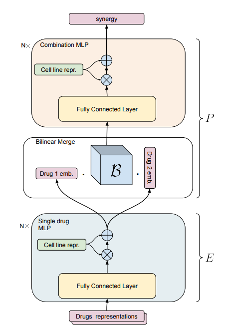

# Machine Learning Driven Candidate Compound Generation for Drug Repurposing
Based on RECOVER: sequential model optimization platform for combination drug repurposing identifies novel synergistic compounds *in vitro*

This repository is an implementation of RECOVER, a platform that can guide wet lab experiments to quickly discover synergistic drug combinations,
([preprint](https://arxiv.org/abs/2202.04202)), howerver instead of using an ensemble model to get Synergy predictions with uncertainty, we used multiple realization of a Bayesian Neural Network model. 
Since the weights are drawn from a distribution, they differ for every run of a trained model and hence give different results. The goal was to get a more precise uncertainty and achieve i quicker since the model doesn't have to be trained multiple times. 

  
  

## Repository overview
There are 4 branches in this Git Repository.

**Master**, where the original RECOVER is stored with Bayesian setup but original config files, so the initial pipeline can be easily recreated.   
**Bayesian_after_merge**, with a Bayesian model used only in the layers after the bilinear merge.   
**Bayesian_before_and_after_merge**, with a Bayesian model used in the layers before and after the bilinear merge.  
**Weight_uncertainty**, a Bayesian Neural Network library implemented from scratch and two priors introduced in order to optimize the model. (https://doi.org/10.48550/arXiv.1505.05424)  

Every branch will be further explaned in its own README.

## Environment setup

**Requirements and Installation**: 
For all the requirements and installation steps dataset and the project check the orginal RECOVER repository (https://github.com/RECOVERcoalition/Recover.git). 

**Potential issues and fixes**
- Use the requirements file from this Repository
- Cloning dataset: Makesure to install Git LFS (Since there are some files over 100 MB git-lfs is needed for cloning.)
- Numpy 1.24 does not support - Even though there was no mention about the numpy version in original RECOVER requirements there are some compatibility issues when using other libraries therefore we have to specifically downgrade numpy to make it working without any issues. Try, pip install numpy==1.22.4
- Ray tune issue: Use the updated train.py within this repo to avoid ray tune path issues when saving checkpoints
- Issues with the config files: Check for such unused modules which are imported and remove them to avoid module not fount errors. 
- rdkit installation path in original Repository is outdated. Try, conda install -c conda-forge rdkit 

## Running the pipeline

Configuration files for our experiments are provided in the following directory: `Recover/recover/config`

To run the pipeline with a custom configuration:
- Create your configuration file and move it to `Recover/recover/config/`
- Run `python train.py --config <my_configuration_file>`

For example, to run the pipeline with configuration from 
the file `model_evaluation.py`, run `python train.py --config model_evaluation`.

Log files will automatically be created to save the results of the experiments.
